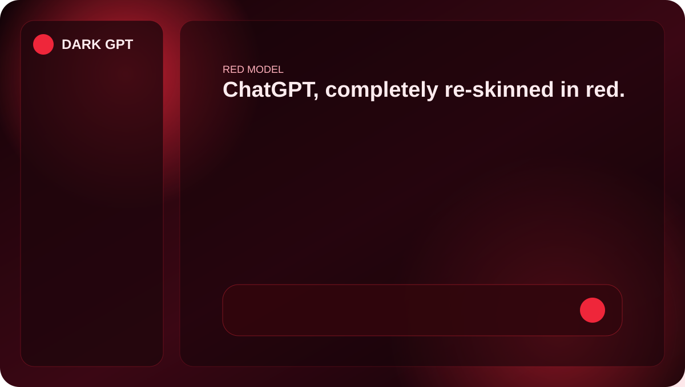

# ChatGPT DARK GPT

A dark-only red redesign of ChatGPT using the existing UI selector coverage.

## Design
- [DARK GPT documentation](./design.md)
- [Manifest](./manifest.json)
- [CSS](./dark-gpt.css)
- [Content script](./content.js)

## Settings
- Mode on/off
- UI/panel brightness
- Red background glow brightness
