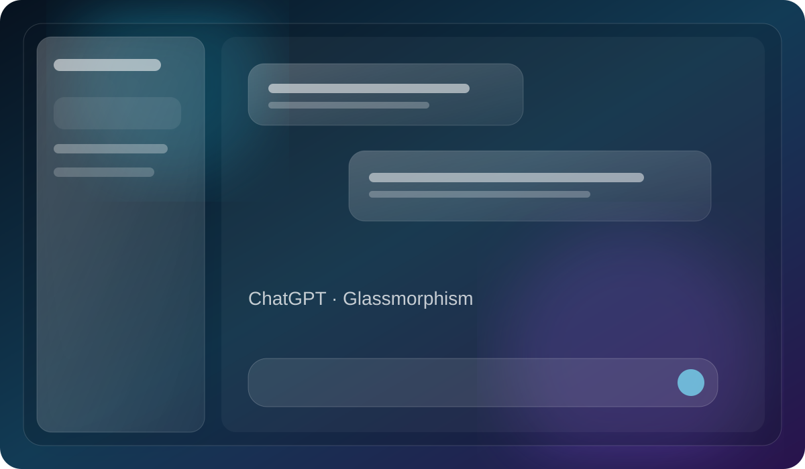

# ChatGPT Glassmorphism

A transparent, layered glass UI for ChatGPT with soft blur, hairline borders, adaptive dark/light surfaces, and an atmospheric animated background.

## Design

- [AI Prompt Tool](./ai-prompt-tool/design.md) — ChatGPT-focused glassmorphism extension with configurable lighting and glass controls.

## Style at a glance

- **Material:** translucent glass
- **Depth:** blur, edge shine, layered shadows
- **Background:** animated ambient light
- **Tone:** futuristic, clean, atmospheric
- **Best for:** dashboards, chat interfaces, productivity tools, and premium AI UI

> The image above is a repository preview illustration of the design direction. The live implementation is available in the linked design folder.

## Navigation

- [Design documentation](./ai-prompt-tool/design.md)
- [HTML](./ai-prompt-tool/index.html)
- [CSS](./ai-prompt-tool/glass.css)
- [JavaScript](./ai-prompt-tool/content.js)
