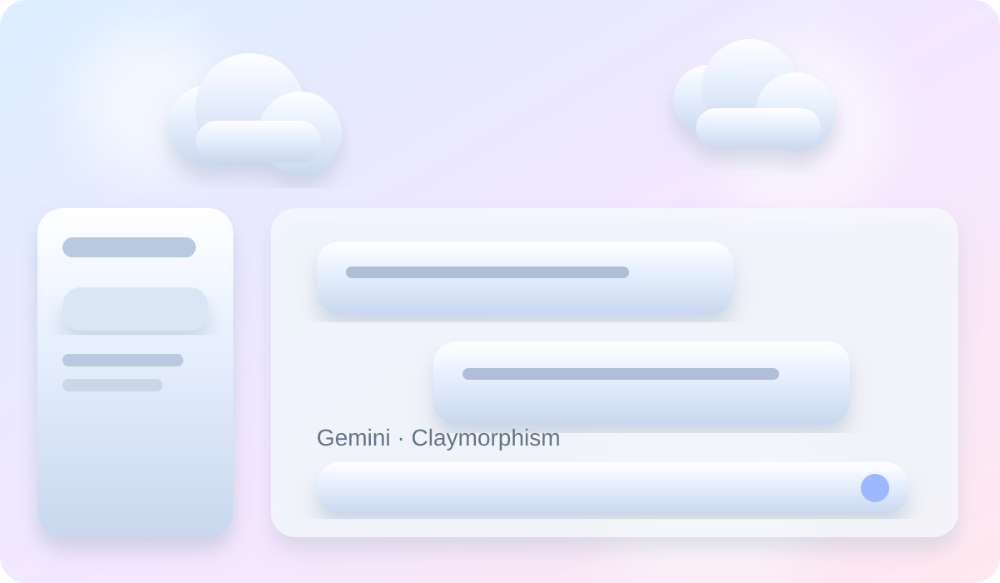

# Gemini Claymorphism

A soft 3D clay interface for Gemini built from rounded surfaces, sculpted shadows, pastel depth, and animated clay clouds.

## Design

- [Gemini Claymorphism](./gemini-claymorphism/design.md) — full Gemini UI claymorphism extension with adjustable cloud speed, size, count, opacity, depth, cursor parallax, and optional 3D navigation hover.

## Style at a glance

- **Material:** soft clay / molded plastic
- **Depth:** inset highlights, rounded geometry, offset shadows
- **Background:** animated 3D clay clouds
- **Tone:** playful, soft, tactile
- **Best for:** creative AI tools, friendly dashboards, playful productivity UIs, and experimental web interfaces

> The image above is a repository preview illustration of the design direction. The live implementation is available in the linked design folder.

## Navigation

- [Design documentation](./gemini-claymorphism/design.md)
- [HTML](./gemini-claymorphism/index.html)
- [CSS](./gemini-claymorphism/clay.css)
- [Cloud CSS](./gemini-claymorphism/clouds.css)
- [JavaScript](./gemini-claymorphism/content.js)
