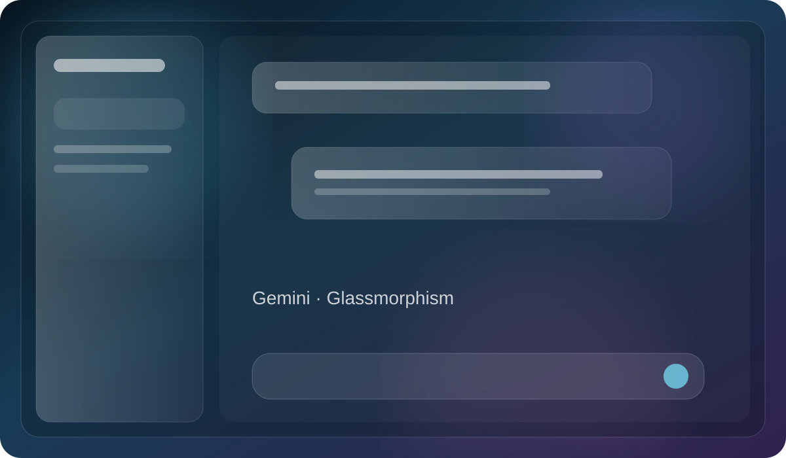

# Gemini Glassmorphism

A frosted-glass visual layer for Gemini with translucent surfaces, atmospheric lighting, adaptive theme handling, and controlled motion.

## Design

- [Gemini Glassmorphism](./gemini-glassmorphism/design.md) — full Gemini UI glassmorphism extension with configurable lighting, blur, opacity, accent, and optional 3D hover.

## Style at a glance

- **Material:** frosted translucent glass
- **Depth:** backdrop blur, hairlines, soft highlights
- **Background:** ambient WebGL lighting with CSS fallback
- **Tone:** futuristic, spacious, polished
- **Best for:** AI chat, research tools, utility panels, and modern web apps

> The image above is a repository preview illustration of the design direction. The live implementation is available in the linked design folder.

## Navigation

- [Design documentation](./gemini-glassmorphism/design.md)
- [HTML](./gemini-glassmorphism/index.html)
- [CSS](./gemini-glassmorphism/glass.css)
- [JavaScript](./gemini-glassmorphism/content.js)
