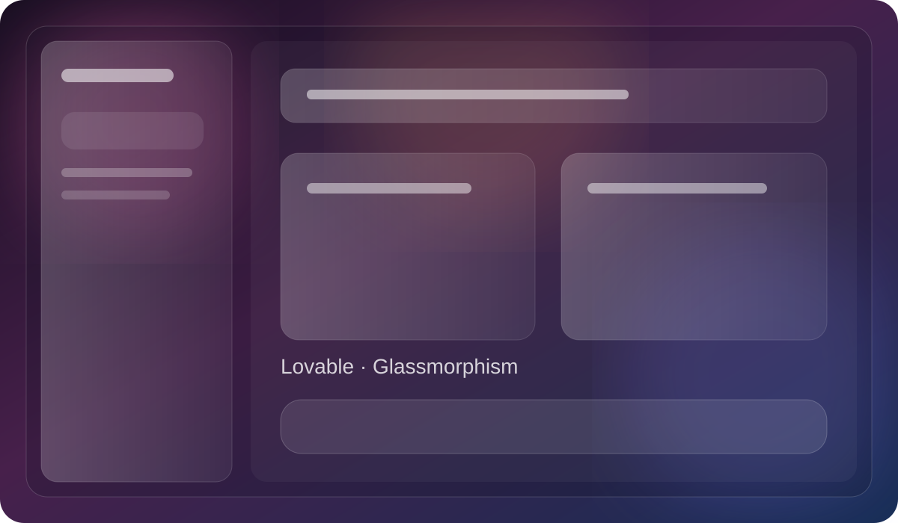

# Lovable Glassmorphism

A colorful glassmorphism layer for Lovable with translucent panels, soft gradient lights, adaptive theme support, and a restrained premium feel.

## Design

- [Lovable Glassmorphism](./lovable-glassmorphism/design.md) — Lovable UI extension with configurable background lights, glass opacity, blur, accent, roundness, and edge shine.

## Style at a glance

- **Material:** translucent glass
- **Depth:** blur, sheen, hairline borders
- **Background:** drifting pink, orange, violet, and blue lights
- **Tone:** colorful, creative, premium
- **Best for:** visual builders, developer tools, SaaS dashboards, and creative workspaces

> The image above is a repository preview illustration of the design direction. The live implementation is available in the linked design folder.

## Navigation

- [Design documentation](./lovable-glassmorphism/design.md)
- [HTML](./lovable-glassmorphism/index.html)
- [CSS](./lovable-glassmorphism/glass.css)
- [JavaScript](./lovable-glassmorphism/content.js)
